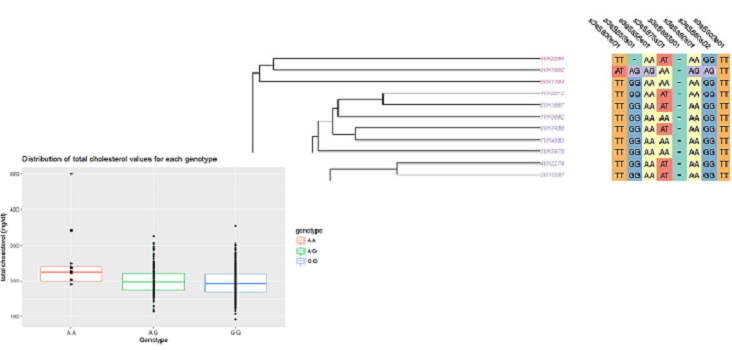

```{r setup, include=FALSE}
knitr::opts_chunk$set(echo = FALSE, warning=FALSE, error=FALSE, message = FALSE)
```

```{r, echo = FALSE}
library(knitcitations)
bib <- read.bibtex("ReferencesGWA.bib")
```

# Introduction

## Genetic Association Studies

Goal: detect the association of genetic variants with a particular trait of interest, e.g. disease or quantitative trait



## Analysis strategies {.smaller}

Several statistical analysis strategies proposed [@Balding2006]:

* binary trait
    + Pearson's $\chi^{2}$-square test for independence testing
    + the Cochran-Armitage trend test [@Armitage1955]
    + multiple two-by-two tables [@Cheng2014a] 
    + the 2 degrees of freedom likelihood ratio test based on logistic regression [@Wellek2012]
* quantitative traits - linear regression and the corresponding F-test 
* count phenotypes - Poisson regression approach [@Qu2014]
* survival outcomes - tests based on the Cox proportional hazards model [@Mendolia2014]

## The genetic mode on inheritance {.smaller}

Commonly three genetic modes of inheritance are considered [@Freidlin2002]:

* dominant model - assumes that either one or two copies of the minor allele are sufficient to produce an (equal) effect on the trait
* additive model -  assumes that the trait effect is linearly related to the number of minor alleles
* recessive model - assumes that the trait effect is related to the presence of both minor alleles

In reality the mode of inheritance is rarely known **a-priori** in genetic association studies.

model-dependent methods: most powerful if the genetic model is specified correctly

model-free techniques: robust, but they are not as powerful 

Combinations exists: unconditional maximum test [@Freidlin2002], [@Hothorn2009], [@Loley2013]

# Methods

## Methods

*  consider an autosomal diallelic marker (e.g., SNP) with alleles $A$ and $a$.
*  genotypes ($AA$, $Aa$ and $aa$) are represented by a quantitative explanatory variable $x_{i}$, with $i = 1,\ldots,n$ independent subjects
*  $x_{i}$ corresponds to the number of copies of the allele $a$, i.e., if subject $i$ has zero copies of the allele $a$ then $x_{i}=0$, and so on
*  consider the generalized linear model [@Nelder1972]:
$$ E(y_{i})=g^{-1}\left(x_{i} \beta + \mathbf{x}_{Ni}'\mathbf{\beta}_N\right) $$ , with e.g. logit link, identity link, or proportional hazards model

## Multiple genetic models

Assess the effect of genotype on the trait under different modes of inheritance consider the following scores:

genetic model  | independent variable | AA | Aa | aa
------------- | -------------|---|---|---
dominant  | $x^{(1)}$ |0|1|1
additive  | $x^{(2)}$ |0|0.5|1
recessive | $x^{(3)}$ |0|0|1

with the vector of all parameters $$\mathbf{\beta}^{j} = (\beta^{j}, \mathbf{\beta}_{N})$$ with $j = 1,2,3$

## Testing marker effects

To test the genetic marker for its association with the phenotype of interest it is assumed that we are interested in the following null hypothesis

$$H_{0}^{(j)}: \hspace{0.5cm} \beta^{(j)}=\beta^{(j)}_{0}, \qquad j=1,2,3,$$
Use the multiple marginal models approach of @Pipper2012 (see also previous talks) to consider simultaneous inference on the parameter vectors from the three genetic models $\mathbf{\beta^{(123)}}=(\mathbf{\beta^{(1)}}, \mathbf{\beta^{(2)}},\mathbf{\beta^{(3)}})$  (see also [@So2011, @Kitsche2016]).


# Applications

## Quantitative trait

The Bogalusa Heart Study dataset [@Smith2010]:

*  525 unrelated individuals of European descent at 545,821 SNPs. 
*  12 clinically relevant phenotypes were measured
*  considering phenotype total cholesterol (measured in milligrams (mg) of cholesterol per deciliter (dl) of blood ) for illustrative purposes
*  SNP rs7738656 in the gene __C6orf170/GJA1__


## Bogalusa Heart Study

```{r}
library(broom)
library(ggplot2)
library(dplyr)
library(multcomp)
library(GAdata)
library(knitr)
library(plotly)
library(tidyr)
library(xtable)
data(chol)
#graphical display via boxplots
#boxplot(tc ~ genotype, data=chol)
p <- ggplot(data = chol, aes(y = tc, x = genotype))
p <- p + 
  geom_boxplot(aes(color = genotype)) +
  geom_jitter(width = 0, height = 0.5) +
  labs(title = "Distribution of total cholesterol values for each genotype",
       y = "total cholesterol (mg/dl)",
       x = "Genotype")
#ggplotly(p)
p
```

## Three genetic models

$$y_{i} \sim \beta_{1} + \beta_{2} x^{(j)}_{i} + \epsilon_{i} \hspace{0.5cm} j = 1,2,3\\$$

```{r}
data_chol <- chol
data_chol %<>%
  select(tc, rec, add, dom) %>%
  gather(data_chol, key = "model_type", - tc) %>%
  arrange(model_type)
  

data_chol$Genotype <- c(
as.character(factor(filter(data_chol, model_type == "add")$data_chol, labels = c("GG", "AG", "AA"))),
as.character(factor(filter(data_chol, model_type == "dom")$data_chol, labels = c("GG", "AG/AA"))),
as.character(factor(filter(data_chol, model_type == "rec")$data_chol, labels = c("GG/AG", "AA"))))
  

data_chol %>%
  ggplot(data = ., aes(x = factor(Genotype), y = tc, group = model_type)) +
  geom_jitter(width = 0.02, height = 0, alpha = 0.3) +
  facet_grid( ~ model_type, scales = "free_x") +
  geom_smooth(method = "lm", se = FALSE) +
    labs(title = "Distribution of total cholesterol values for different modes of inheritance",
       y = "total cholesterol (mg/dl)",
       x = "Genotype") -> p
#ggplotly(p)
p

```


## Results - Quantitative trait
```{r, results="asis"}
library(xtable)
#calculating the allele frequencies
#table(chol$genotype)#A is the minor allele
#Approach using three different genetic models
madd <- lm(tc ~ add, data=chol) #lin reg add
mrec <- lm(tc ~ rec, data=chol) #lin reg rec
mdom <- lm(tc ~ dom, data=chol) #lin reg dom
#simultaneous assessment of multiple marginal models
g <- glht(mmm(m1=madd, m2=mrec, m3=mdom), mlf(m1="add=0", m2="rec=0",m3="dom=0"))
kable(tidy(summary(g)), 
      caption = "Results from the association analysis of the quantitative trait of total cholesterol with the SNP rs7738656.", digits = c(1,1,2,2,2,7))
```


Conclusion: SNP rs7738656 is associated with the amount of total cholesterol with an effect of 52.65 mg/dl of the homozygous recessive genotype.

## Case-Control study

Genome-wide association study (GWAS) on severe falciparum malaria:

* association with SNP rs10900589 in the ATPase, Ca ++ transporting, plasma membrane 4 (_ATP2B4_) gene [@Timmann2012, @Loley2013] 
* data of the SNP rs10900589 for the Gambian population (N = 2209):

Genotypes|TT|GT|GG
------------- | -------------| -------------| -------------
Cases|472|377|59 
Controls|672|507|122

## Results - Case-Control study

$$\text{logit}(y_{i})= \beta_{0} + \beta_{1}x^{(j)}_{i}, \hspace{0.5cm} j = 1,2,3\\$$
with $$\text{logit}(y_{i})=\text{log}(P(y_{i}=1)/(1-P(y_{i}=1))$$, where $P(y_{i}=1)$ is the probability that a randomly selected individual is diseased. 
```{r, fig.height=15, fig.width=15}
data(Gambian)
Gambian$Genotype <- factor(Gambian$Genotype, levels=c("TT","GT","GG"))
Gambian$GenNum <- as.numeric(Gambian$Genotype)

#pseudo numeric variables for different modes of inheritance
Gambian$Add <- c(0, 0.5, 1)[Gambian$GenNum]
Gambian$Dom <- c(0, 1, 1)[Gambian$GenNum]
Gambian$Rec <- c(0, 0, 1)[Gambian$GenNum]
#Approach using three different genetic models
GLMdom <- glm(y ~ Dom ,family=binomial, data=Gambian)
GLMadd <- glm(y ~ Add ,family=binomial, data=Gambian)
GLMrec <- glm(y ~ Rec ,family=binomial, data=Gambian)

#simultaneous assessment of multiple marginal models
g <- glht(mmm(m1=GLMdom, m2=GLMadd, m3=GLMrec), mlf(m1="Dom=0",m2="Add=0", m3="Rec=0"))
kable(tidy(summary(g)), digits = c(1,1,2,2,2,5))
```

## Survival Endpoint

Experiment on susceptibility to \textit{Listeria monocytogenes} infection in mouse were considered [@Boyartchuk2001]:

* susceptibility of mice to _Listeria monocytogenes_ infection was defined as the number of hours elapsed between injection and death of the animal
* Mice surviving after 264 hours were considered recovered from the disease
* A total number of 120 individuals was typed at 133 markers; we consider _D13Mit147_ within here

## Kaplan-Meier curves for _D13Mit147_

```{r, fig.height=5.5, fig.width=8}
library(survminer)
data(listerD13Mit147)
#Kaplan-Meier plot
kapmei <- survfit(Surv(pheno, cens) ~ geno, data = listerD13Mit147)
#plot(kapmei, lty = c(3,4,1))
#legend("topright", legend = c("aa", "Aa", "AA"), lty = c(3,4,1))
#table(listerD13Mit147$geno)#a is the minor allele
ggsurvplot(kapmei,  size = 1,  # change line size
           palette = c("#E7B800", "#2E9FDF", "#FF6C00"), # custom color palettes
           #conf.int = TRUE, # Add confidence interval
           #pval = TRUE, # Add p-value
           risk.table = TRUE, # Add risk table
           risk.table.col = "strata", # Risk table color by groups
           legend.labs = c("AA", "Aa", "aa"), # Change legend labels
           risk.table.height = 0.25, # Useful to change when you have multiple groups
           ggtheme = theme_bw()) # Change ggplot2 theme
```


## Results - Survival endpoint

Consider three Cox proportional hazard models:

$$\lambda_{i}(t)=\lambda_{0}(t)e^{x^{(j)}_{i}\beta}, \hspace{0.5cm} j = 1,2,3$$
where the exponentiated coefficients $\text{exp}(\beta)$ represent the multiplicative change in risk due to the variable $x^{(j)}_{i}$ under consideration

```{r}
listerD13Mit147$numgeno <- as.numeric(listerD13Mit147$geno)
#Approach using three different genetic models
listerD13Mit147$add <- c(0, 0.5, 1)[listerD13Mit147$numgeno]
listerD13Mit147$rec <- c(0, 0, 1)[listerD13Mit147$numgeno]
listerD13Mit147$dom <- c(0, 1, 1)[listerD13Mit147$numgeno]
#Approach using three different genetic models
madd <- coxph(Surv(pheno, cens) ~ add, data=listerD13Mit147) #lin reg add
mrec <- coxph(Surv(pheno, cens) ~ rec, data=listerD13Mit147) #lin reg rec
mdom <- coxph(Surv(pheno, cens) ~ dom, data=listerD13Mit147) #lin reg dom
#simultaneous assessment of multiple marginal models
g <- glht(mmm(m1=madd, m2=mrec, m3=mdom), mlf(m1="add=0", m2="rec=0",
m3="dom=0"))
kable(tidy(summary(g)), digits = c(1,1,2,2,2,7))
```


## Overdominant Mode of Inheritance

Several other modes of inheritance were published in the scientific literature, see e.g., [@Swanson-Wagner2006], i.e. overdominant genetic model [@Li2009]:

genetic model  | independent variable | AA | Aa | aa
------------- | -------------|---|---|---
dominant  | $x^{(1)}$ |0|1|1
additive  | $x^{(2)}$ |0|0.5|1
recessive | $x^{(3)}$ |0|0|1
overdominant|$x^{(4)}$|0|1|0

This mode of inheritance models an advantage of the heterozygous genotype over the homozygous genotypes.

## Overdominant Mode of Inheritance

Case-Control study of breast cancer [@Hunter2007]

* genotyping 528,173 SNPs in 1,145 postmenopausal women of European ancestry with invasive breast cancer and 1,142 controls
* consider the SNP rs7696175

Genotypes|AA|Aa|aa
------------- | -------------| -------------| -------------
Cases|187| 605| 353
Controls|249| 496| 396

## Results - Overdominant Mode of Inheritance

$$\text{logit}(y_{i})= \beta_{0} + \beta_{1}x^{(j)}_{i}, \hspace{0.5cm} j = 1,2,3,4$$

```{r}
data(rs7696175)
#define the numeric scoring
rs7696175$GenNum <- as.numeric(rs7696175$Genotype)
rs7696175$Add <- c(0, 0.5, 1)[rs7696175$GenNum]
rs7696175$Dom <- c(0, 1, 1)[rs7696175$GenNum]
rs7696175$Rec <- c(0, 0, 1)[rs7696175$GenNum]
rs7696175$OverDom <- c(0, 1, 0)[rs7696175$GenNum]
# Fitting the four logistic regression models
GLMdom <- glm(y ~ Dom ,family=binomial, data=rs7696175)
GLMadd <- glm(y ~ Add ,family=binomial, data=rs7696175)
GLMrec <- glm(y ~ Rec ,family=binomial, data=rs7696175)
GLMover <- glm(y ~ OverDom ,family=binomial, data=rs7696175)
# Simultaneous assessing multiple marginal models
MultTest <- glht(mmm(m1=GLMdom, m2=GLMadd, m3=GLMrec, m4=GLMover),
                 mlf(m1="Dom=0", m2="Add=0", m3="Rec=0", m4="OverDom=0"))
ResultMMM <-summary(MultTest)
kable(tidy(ResultMMM), digits = c(1,1,2,2,2,7))
```

## Interaction of Two Loci

Detection of epistatic effects:  the phenomenon of the effect of one gene (locus) being dependent on the presence of one or more modifier genes

study from the data set _srdta_ within the `GenABEL.data`  package [@GenABEL2013]

* results on a small region of about 2.5 Mb
* 833 SNPs are typed on 2500 people
* variables sex, age, two quantitative and one binary traits are available for analysis
* we focus on one quantitative trait (namely _qt1_ in the package) the two SNPs rs10 and rs6585 and the covariates sex and age

## Interaction of Two Loci - The Model {.smaller}

$$y_{i}= \beta_{0} + \beta_{1}sex_{i} + \beta_{2}age_{i} + \beta_{3}x^{(j)}_{rs10 i} + \beta_{4}x^{(k)}_{rs6585 i} + \beta_{5}x^{(j)}_{rs10 i}\cdot x^{(k)}_{rs6585 i}, \hspace{0.5cm} j,k = 1,2,3$$

*  where $x^{(j)}_{rs10 i}$ is the appropriate coding for the genotype at locus rs10 for subject $i$ assuming model $j$
*  $x^{(k)}_{rs6585 i}$ is coding for the genotype at locus rs6585, assuming model $k$
*  the parameter $\beta_{3}$ is the slope for the rs10 locus
*  $\beta_{4}$ is the slope specific to the rs6585 locus
*  $\beta_{5}$ is the interaction effect between locus rs10 and rs6585 for the $j \times k$ model. 

Our goal is now to make simultaneous inference on the parameter of the interaction effect $\beta_{5}$ for all $j \times k$ combinations of genetic models.


## Results - Interaction of Two Loci {.smaller}


```{r}
library(GenABEL)
data(srdta)
x <- srdta@gtdata
Subset_SNP_names <- c("rs10", "rs6585")
ID_names <- idnames(x)
geno_data <- as.data.frame(as.character(x[ID_names, Subset_SNP_names]))
geno_data$qt1 <- srdta@phdata[, 4]
geno_data$sex <- srdta@phdata[, 2]
geno_data$age <- srdta@phdata[, 3]
geno_data$Add_SNP1 <- c(0, 0.5, 1)[geno_data[,1]]
geno_data$Dom_SNP1 <- c(0, 1, 1)[geno_data[,1]]
geno_data$Rec_SNP1 <- c(0, 0, 1)[geno_data[,1]]
geno_data$Add_SNP2 <- c(0, 0.5, 1)[geno_data[,2]]
geno_data$Dom_SNP2 <- c(0, 1, 1)[geno_data[,2]]
geno_data$Rec_SNP2 <- c(0, 0, 1)[geno_data[,2]]
GLM_Add_SNP1_Add_SNP2 <- glm( qt1 ~ sex + age + Add_SNP1 * Add_SNP2 ,
family=gaussian, data=geno_data)
GLM_Dom_SNP1_Add_SNP2 <- glm( qt1 ~ sex + age + Dom_SNP1 * Add_SNP2 ,
family=gaussian, data=geno_data)
GLM_Rec_SNP1_Add_SNP2 <- glm( qt1 ~ sex + age + Rec_SNP1 * Add_SNP2 ,
family=gaussian, data=geno_data)
GLM_Add_SNP1_Dom_SNP2 <- glm( qt1 ~ sex + age + Add_SNP1 * Dom_SNP2 ,
family=gaussian, data = geno_data)
GLM_Dom_SNP1_Dom_SNP2 <- glm( qt1 ~ sex + age + Dom_SNP1 * Dom_SNP2 ,
family=gaussian, data=geno_data)
GLM_Rec_SNP1_Dom_SNP2 <- glm( qt1 ~ sex + age + Rec_SNP1 * Dom_SNP2 ,
family=gaussian, data=geno_data)
GLM_Add_SNP1_Rec_SNP2 <- glm( qt1 ~ sex + age + Add_SNP1 * Rec_SNP2 ,
family=gaussian, data=geno_data)
GLM_Dom_SNP1_Rec_SNP2 <- glm( qt1 ~ sex + age + Dom_SNP1 * Rec_SNP2 ,
family=gaussian, data=geno_data)
GLM_Rec_SNP1_Rec_SNP2 <- glm( qt1 ~ sex + age + Rec_SNP1 * Rec_SNP2 ,
family=gaussian, data=geno_data)
K_Interaction <- matrix(c(0, 0, 0, 0, 0, 1), nrow=1, byrow=TRUE)
Interaction_test <- glht(mmm(m1=GLM_Add_SNP1_Add_SNP2,
m2=GLM_Dom_SNP1_Add_SNP2, m3=GLM_Rec_SNP1_Add_SNP2,
m4=GLM_Add_SNP1_Dom_SNP2, m5=GLM_Dom_SNP1_Dom_SNP2,
m6=GLM_Rec_SNP1_Dom_SNP2, m7=GLM_Add_SNP1_Rec_SNP2,
m8=GLM_Dom_SNP1_Rec_SNP2, m9=GLM_Rec_SNP1_Rec_SNP2),
mlf(K_Interaction))
results_interaction <- tidy(summary(Interaction_test))
results_interaction$lhs <- c(
	"Additive x Additive",
  "Dominant x Additive",
  "Recessive x Additive",
  "Additive x Dominant",
  "Dominant x Dominant",
  "Recessive x Dominant",
  "Additive x Recessive", 
  "Dominant x Recessive",
  "Recessive x Recessive"
)
kable(results_interaction, digits = c(1,1,2,2,2,7))
```


## Conclusions {.smaller}

Summary:

* Multiple marginal models reflect different modes of inheritence
* Approach covers a wide variety of endpoints (binary, count, quantitative, and time-to-event data)
* Multiple endpoints of different types can be assessed simultaneously (analysis of pleiotropic effects)
* Multiple loci can be assessed simultaneously while taking different modes of inheritance into account (analysis of epistatic effects)
* General model formualtion allows the inclusion of additional covariates, e.g. population stratification
* Simultaneous confidence intervals for estimated parameters are available too (not presented)

Limitations:

* Applicable to a preselected subset of SNPs on GWAS
* Useful for candidate gene or candidate polymorphism studies


## Software

The functionality for the simultaneous inference for multiple marginal models is implemented in the R add-on package `library(multcomp)` [@Hothorn2008]

All data sets available at:

```{r, eval=FALSE, warning=FALSE, error=FALSE, echo=TRUE}
#install.packages("devtools")
library(devtools)
install_github("AKitsche/GAdata")
library(GAdata)
```

`.html` and `.Rmd` files for the slides at https://github.com/AKitsche/Talk_MMM_GA


<style>
slides > slide { overflow: scroll; }
slides > slide:not(.nobackground):after {
  content: '';
}
</style>

## References